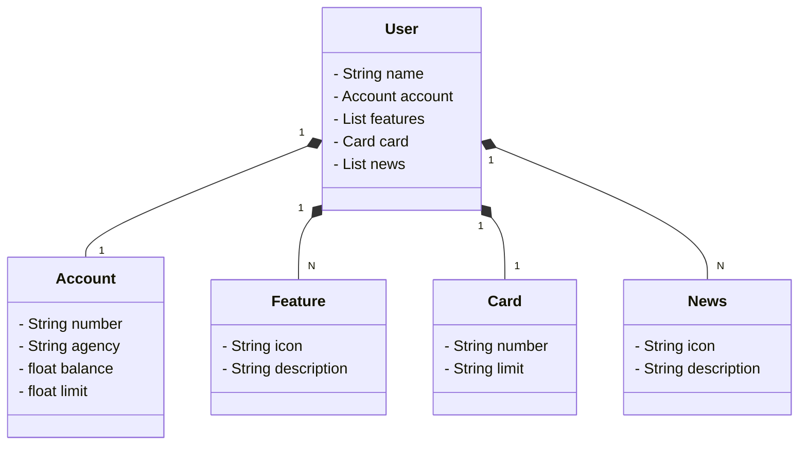

# Santander Bootcamp Backend Java 2024
Java RESTful API criada para a Santander Bootcamp Backend Java 2024.

## Diagrama de Classe

```mermaid
classDiagram
  class User {
    - String name
    - Account account
    - List<Feature> features
    - Card card
    - List<News> news
  }
  
  class Account {
    - String number
    - String agency
    - float balance
    - float limit
  }
  
  class Feature {
    - String icon
    - String description
  }
  
  class Card {
    - String number
    - String limit
  }
  
  class News {
    - String icon
    - String description
  }
  
  User "1" *-- "1" Account
  User "1" *-- "N" Feature
  User "1" *-- "1" Card
  User "1" *-- "N" News
```
